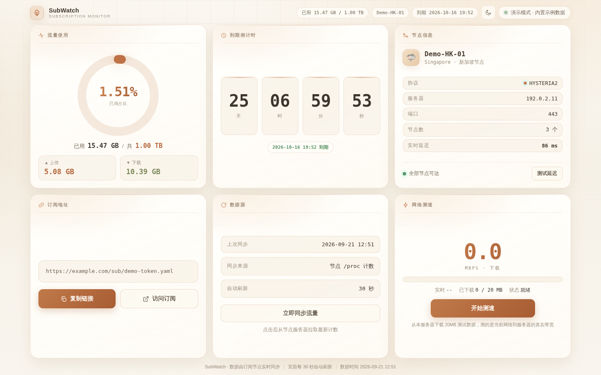

# SubWatch · 订阅流量监控面板

> 一个**单文件、零依赖**的订阅流量实时监控面板。桌面端一屏看完全部信息，移动端 Tab 切换；内置深色 / 米色双主题一键切换。



---

## ✨ 特性

| | |
|---|---|
| 🖥 **一屏不滚动** | 桌面端 3×2 等大卡片网格，精确铺满视口高度，不出现滚动条 |
| 📱 **移动端 Tab** | 概览 / 节点 / 订阅 / 测速 四个 Tab，每个 Tab 同样一屏装下 |
| 🌗 **双主题** | 深色科技风 ⇄ 米色护眼版，右上角一键切换，选择本地记忆 |
| 📊 **流量可视化** | 环形进度图 + 已用 / 总量 / 上传 / 下载，一眼看清额度 |
| ⏱ **到期倒计时** | 天 / 时 / 分 / 秒实时跳动，临近到期自动高亮提醒 |
| 🛰 **节点探测** | 节点协议 / 地址 / 端口 + 一键 TCP 连通性延迟测试 |
| ⚡ **在线测速** | 流式下载 20MB 实时计算带宽，带进度与瞬时速率 |
| 🔌 **零依赖** | 纯 HTML + CSS + 原生 JS 单文件，无需构建、无需 npm |
| 🧪 **演示模式** | 双击打开即为示例数据，附带纯标准库示例后端 |

## 🚀 快速开始

### 方式一：直接预览（演示模式）

下载后**双击 `index.html`**（或拖入浏览器）即可 —— 页面检测到 `file://` 协议会自动启用**内置示例数据**，所有交互与动画都能体验。
也可以在地址后面加 `?demo=1` 强制启用演示模式。

### 方式二：运行示例后端（推荐，功能最完整）

示例后端用 Python 标准库实现，无任何第三方依赖：

```bash
python3 api/demo_server.py
# → 浏览器打开 http://127.0.0.1:8899/
```

它会同时托管页面并提供完整的三个接口（含真实的流式测速）。

### 方式三：对接你自己的后端

页面默认请求**同源**的 `/subinfo-api`。你可以：

```html
<!-- 1) 在 <html> 上声明（也可写在 <body>） -->
<html data-api-base="https://your-api.example.com/subinfo-api">

<!-- 2) 或在页面加载前用 JS 指定 -->
<script>window.SUBWATCH_API_BASE = "https://your-api.example.com/subinfo-api";</script>
```

然后在自己的服务里按下面的契约实现接口即可。

## 📐 后端接口契约

| 方法 | 路径 | 说明 |
|---|---|---|
| `GET` | `/api/subinfo` | 主数据：流量 / 节点 / 到期时间 |
| `GET` | `/api/ping` | 节点 TCP 延迟（建议缓存 10~15s） |
| `GET` | `/api/speedtest?size=N` | 返回 N 字节下载流（建议关闭反向代理缓冲） |
| `POST` | `/api/refresh` | 触发一次流量同步 |

<details>
<summary><b>GET /api/subinfo 响应示例</b>（点击展开）</summary>

```json
{
  "ok": true,
  "subscription_url": "https://example.com/sub/demo-token.yaml",
  "upload": 5454608465,
  "download": 11156177551,
  "total": 1099511627776,
  "used": 16610786017,
  "used_percent": 1.51,
  "expire": 1791280255,
  "days_left": 25,
  "updated_at": 1789095017,
  "fmt": {
    "upload": "5.08 GB",
    "download": "10.39 GB",
    "total": "1.00 TB",
    "used": "15.47 GB"
  },
  "nodes": {
    "count": 3,
    "proxies": [
      { "name": "Demo-HK-01", "type": "hysteria2", "server": "192.0.2.11", "port": 443 }
    ]
  },
  "refreshing": false,
  "server_time": 1789095073
}
```

> `fmt.*` 是后端格式化好的可读字符串；`expire` / `updated_at` / `server_time` 为 **Unix 秒级时间戳**。
</details>

<details>
<summary><b>GET /api/ping 响应示例</b>（点击展开）</summary>

```json
{ "nodes": [ { "name": "Demo-HK-01", "tcp_ms": 86 }, { "name": "Demo-SG-02", "tcp_ms": null } ] }
```

`tcp_ms` 为 `null` 表示该节点不可达，前端会显示为「不可达」。
</details>

## 🎨 主题切换

右上角按钮一键切换，选择保存在浏览器 `localStorage`（键名 `subwatch-theme`），刷新后保持。

实现方式：米色主题是一层**独立的 `<style id="theme-beige">`**，切换时通过 `style.disabled` 开关，因此两套主题各自完整、互不污染。

- 默认主题：**米色护眼版**（米白底 `#f8f4ec` + 深暖棕字 + 陶土橙强调色）
- 备选主题：**深色科技风**（深蓝底 + 青色霓虹）

## 🛠 自定义

| 想改什么 | 改哪里 |
|---|---|
| 后端地址 | `data-api-base` 属性或 `window.SUBWATCH_API_BASE` |
| 轮询间隔（默认 30s） | JS 中 `setInterval(..., 30000)` |
| 测速大小（默认 20MB） | JS 中 `SPEED_SIZE = 20 * 1024 * 1024` |
| 配色 | 文件顶部 `:root{}` 内的 CSS 变量 |

## 🌐 浏览器兼容

需要支持 `ReadableStream`、`backdrop-filter`、CSS 自定义属性与 `100dvh` 的现代浏览器：
Chrome / Edge 90+、Safari 15+、Firefox 90+。

## 📄 License

[MIT](LICENSE) © 2026 JunWan666

---

<sub>项目中的所有示例数据（节点名、IP、订阅地址）均为虚构，IP 使用 RFC 5737 文档保留地址段。</sub>
